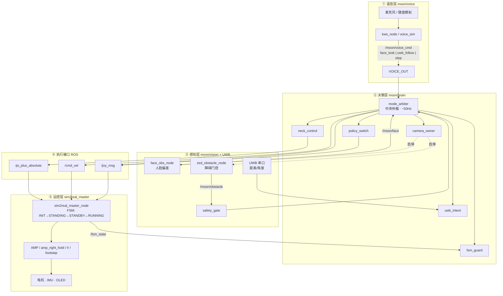
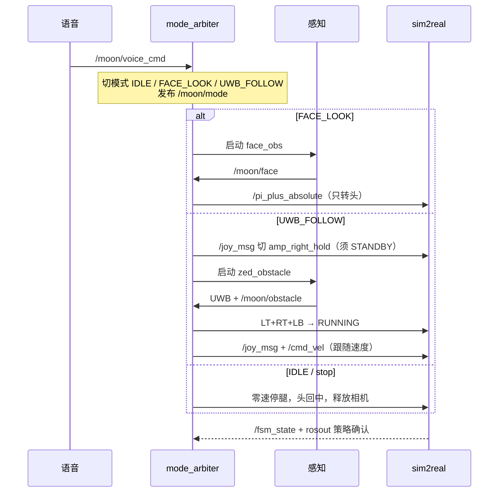

# 机器人系统控制架构

整机控制两层分工：上层 `moon`（语音 / 感知 / 决策），下层 `sim2real`（运控 / 电机）。  
原则：**感知和语音只上报，`mode_arbiter` 唯一下发执行指令。**

---

## 图 1 — 系统总架构

---

## 图 2 — 控制闭环：语音 → 模式 → 感知 → 决策 → 执行

---

## 口令映射

| 口令 | 命令 | 模式 | 行为 |
|------|------|------|------|
| 小派看我 | `face_look` | `FACE_LOOK` | 只转头 |
| 小派我们走 | `uwb_follow` | `UWB_FOLLOW` | 切 `amp_right_hold` → UWB 跟随 + 障碍门控 |
| 小派停止 | `stop` | `IDLE` | 停腿、头回中 |

## 分层路径

| 层 | 路径 |
|----|------|
| 语音 | `moon/voice/` |
| 决策 | `moon/brain/` |
| 感知 | `moon/vision/` + UWB |
| 运控 | `sim2real_master` |

## 上电自启

| 服务 | 作用 |
|------|------|
| `moon-kws.service` | 默认开录音设备 + 离线 KWS → `/moon/voice_cmd` |
| `moon-arbiter.service` | 中央决策，订阅口令 |

安装：见 `moon/voice/README.md`「上电默认开麦」。  
**不要**与独立 `uwb-follow.service` 同时 enable（抢串口 / `cmd_vel`）。
